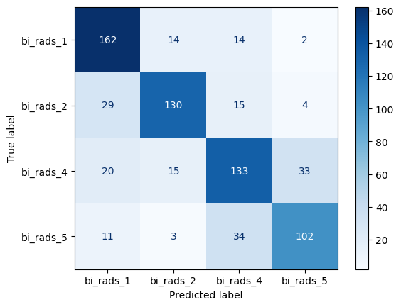

# BI-RADS Classification

This project contains **Mammography Images Classification Model** for **BI-RADS categories** using deep learning with attention mechanisms.

 <!-- Bu görseli projenize uygun şekilde ekleyin -->

## 📌 Features
- **DICOM Preprocessing**: Cropping with YOLOv5-based breast region detection, Mask, Clahe, Dicom Windowing
- **Advanced Architecture**: RegNet backbone + Multi-head Attention Mechanism
- **Multi-class Classification**: BI-RADS 0 to 5 support

## 🛠️ Installation
```bash
git clone https://github.com/ozanguneyli/bi_rads_classification.git
cd bi_rads_classification
pip install -r requirements.txt
```

## Project Structure
```
📂 bi_rads_classification/
├── Breast_Cropper.pt       # YOLOv5-based cropper weights
├── model.py                # Main model architecture
├── preprocessing_pipeline.ipynb  # Full preprocessing workflow
├── requirements.txt
└── README.md
```


## 📊 Results (Our Implementation)
Key Metrics:
Best val Acc: 0.729282
Test Accuracy: 0.7309
F1 Score: 0.7298

